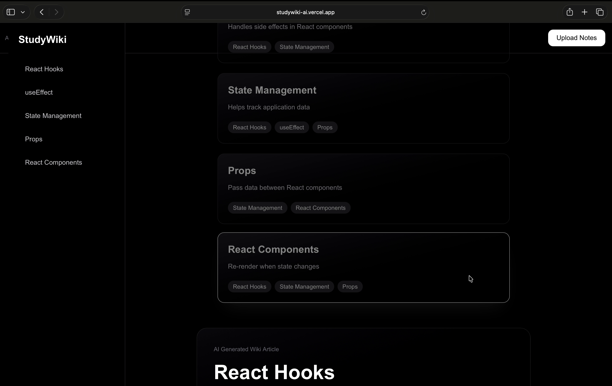
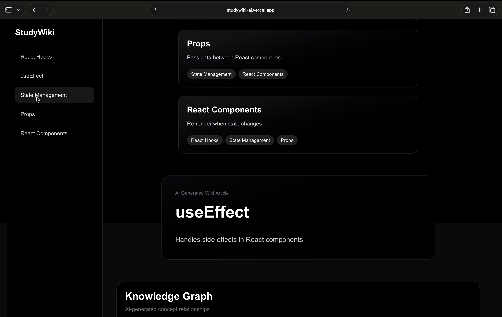
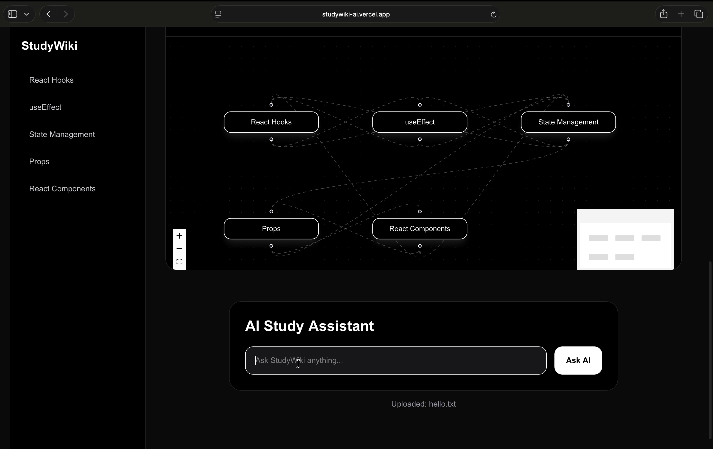

# StudyWiki AI

AI-powered semantic learning platform built with Next.js, Groq, and HydraDB.

Transform raw notes into structured wiki pages, semantic knowledge graphs, and contextual AI reasoning systems.

---

# Live Demo

https://studywiki-ai.vercel.app

---

# Features

- AI-generated wiki topics
- Semantic knowledge graph visualization
- Contextual AI chat assistant
- Interactive topic navigation
- Drag-and-drop notes upload
- HydraDB persistent memory integration
- Groq ultra-fast inference

---

# Screenshots

## Upload Interface



---

## AI Wiki Topics



---

## Knowledge Graph



---

## AI Chat Assistant


---

# Tech Stack

- Next.js 16
- TypeScript
- Tailwind CSS
- Groq API
- HydraDB
- React Flow
- React Dropzone
- Framer Motion

---

# How It Works

1. Upload study notes
2. AI extracts semantic concepts
3. Wiki topics are generated
4. Relationships become a knowledge graph
5. Users can ask contextual AI questions
6. Knowledge is persisted using HydraDB

---

# Local Development

Install dependencies:

```bash
npm install
```

Run development server:

```bash
npm run dev
```

Open:

```txt
http://localhost:3000
```

---

# Environment Variables

Create `.env.local`

```env
GROQ_API_KEY=your_groq_api_key
HYDRA_API_KEY=your_hydra_api_key
HYDRA_TENANT_ID=studywiki-ai
```

---

# Architecture

StudyWiki AI combines:

- Groq for low-latency LLM inference
- HydraDB for persistent semantic memory
- React Flow for relationship visualization
- Next.js App Router for scalable frontend/backend architecture

---

# Future Improvements

- PDF support
- Multi-document memory
- Flashcard generation
- Quiz generation
- Collaborative study spaces
- RAG-based retrieval

---

# Built For

HydraDB Wikithon Hackathon 🚀